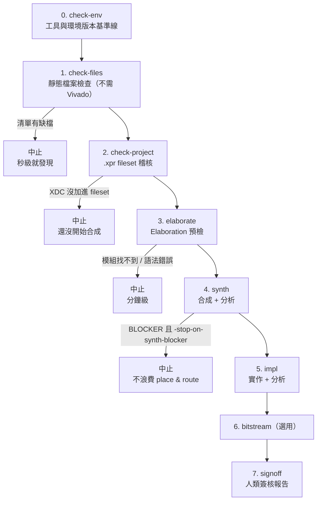

# vivado-report-analyze-flow

在離線工作站上，把每一次 Vivado 執行的報告壓縮成一份「AI agent 讀得完」的摘要，
在合成開始**之前**就擋掉「用到過期 RTL / 沒加進 fileset 的 XDC」這類問題，
並對結果做**風險分級**，明確回答：**這個 bitstream 能不能拿去上板驗證？哪些問題必須先解掉？**

針對的環境：

| 項目 | 版本 |
|---|---|
| Vivado | **2024.2**，project mode（`.xpr` + `launch_runs`） |
| OS | 執行時自動偵測並記錄（不寫死；不在 2024.2 支援清單時會明確標示） |
| 網路 | 離線，無法 pip 安裝套件 —— 所以全部只用 Python 標準函式庫 |
| AI agent | OpenCode 1.17.3 + Qwen3.6-27B（本地執行） |

---

## 解決的三個問題

**1. Report 太大，塞爆 context window**

一份 routed 的 `report_timing_summary` 動輒上萬行。這個 flow 在本地先用 Python 解析，
只留下真正會影響判斷的內容：WNS/TNS/WHS/THS、`check_timing` 統計、clock 清單、
**最差的 10 條路徑**、以及跟上一次執行的比較。產出的 `latest_<run>.md` 大約 60~80 行。

需要看某條路徑的完整細節時，再用 `--show-path` 單獨撈出來 —— 預設精簡，需要才展開。

**2. 跑完才發現用的不是最新版本**

最常見的成因是：改了 `.xdc` 但忘記 `add_files` 加進 `constrs_1`。
這種情況 Vivado 自己的 out-of-date 偵測**不會**觸發 —— 因為那個檔案從頭到尾就不屬於這個
專案，無從偵測起。等到跑完一整輪 implementation 看到 timing 不對勁，時間已經浪費掉了。

`tcl/preflight_and_run.tcl` 在 `launch_runs` 之前先做稽核，發現問題直接中止：

- 磁碟上有 `.xdc` / RTL，但不在 fileset 裡 → **錯誤，中止**
- 專案引用的檔案在磁碟上已不存在 → **錯誤，中止**
- constraint 檔被 disable（`IS_ENABLED` = 0）→ **錯誤，中止**
- constraint 檔沒有用於 synthesis 或 implementation → 警告
- synth run 與 impl run 使用不同的 constraint fileset → 警告

同時對所有 RTL/XDC 做 sha256，跟上一次成功建置的紀錄比對。內容真的變了才 `reset_run`
強制乾淨重跑；沒變就沿用 Vivado 原本的 incremental 行為，不會每次都被迫全部重跑。

> 因為 XDC 沒有納入 git 版控，**檔案內容 hash 是唯一可靠的版本依據**，所以這裡不看 mtime
> （checkout / rsync 會動到 mtime 但內容沒變，不該觸發重跑）。RTL 的 git commit 只是額外
> 的佐證資訊。建議有空時把 `.xdc` 也納入 git，追蹤會更直接。

**3. 光看數字不知道「能不能上板」**

WNS = -0.234 ns 到底是「先上板沒關係」還是「絕對不能上板」？這需要 FPGA 的領域判斷，
而不只是把數字列出來。而且真正會在實機上咬人的問題（metastability、未指定 I/O standard、
壅塞）大多**不在 timing report 裡**。

所以除了 timing，flow 還會產生並解析 utilization、DRC、methodology、CDC、
clock interaction、control sets、IP status、QoR assessment，
**以及 Vivado 的 log**，然後對所有發現做風險分級。

**4. 沒有一個涵蓋整個流程的檢查，也沒有給人簽核的報告**

檔案清單裡的檔案在不在？工具版本換了沒？模組有沒有接上？這些散在不同地方，
而且沒有一份東西能拿給人看著簽名。所以流程被拆成八個階段（見下節），
每階段都能單獨執行，最後產出一份完整可稽核的 sign-off 報告。

---

## 完整分析流程：八個階段

從輸入檔案到簽核報告，一次完整執行會經過八個階段。
**前四個階段都在合成開始之前**，這是刻意的設計原則：**越便宜的檢查越早做**。



### 各階段做什麼

| # | 階段 | 檢查什麼 | 負責的檔案 | 需要 Vivado |
|---|---|---|---|---|
| 0 | `check-env` | Vivado 版本與 build、OS、主機、Python；**與上次的基準線比對** | `tcl/check_environment.tcl`、`python/environment.py` | 是（取版本） |
| 1 | `check-files` | file list 每個檔案是否存在、`+incdir+` 目錄、**清單與 .xpr 雙向對帳**（直接讀 XML，不需 Vivado）、**被實例化但沒有定義的模組**、top module 是否存在、重複模組定義 | `python/filelist.py` | **否** |
| 2 | `check-project` | fileset vs 磁碟差集、專案引用但已不存在的檔案、被 disable 的 constraint、`USED_IN_*`、synth/impl constraint fileset 是否一致；同時算 RTL/XDC 的 sha256 manifest | `tcl/preflight_and_run.tcl`、`python/manifest.py` | 是 |
| 3 | `elaborate` | `synth_design -rtl` 只做 elaboration：模組找不到、port 寬度不匹配、`include` 遺失、語法錯誤 | `tcl/elaborate_check.tcl` | 是 |
| 4 | `synth` | 合成後的時序（**當作估算值評分**）、資源、CDC、log 訊息 | `tcl/preflight_and_run.tcl` | 是 |
| 5 | `impl` | 繞線後的完整分析：timing、utilization、DRC、methodology、CDC、clock interaction、control sets、IP status、QoR | 同上 | 是 |
| 6 | `bitstream` | 延伸到 `write_bitstream` 並確認 `.bit` 確實產生 | 同上 | 是 |
| 7 | `signoff` | 彙整全部階段，產出**人類審閱簽核**用的完整報告 | `python/signoff_report.py` | **否** |
| — | `gen-ip` | 把階段 1 找到的缺 IP 尺寸交給**你自己的**產生腳本，跑完查核 IP 是否真的存在 | `tcl/generate_missing_ip.tcl` | 是（需明確要求） |

### 三個貫穿全流程的原則

**a) 能在建置前發現的，絕不等到建置後**

階段 1 抓的是「改了 `.xdc` 但沒 `add_files`」「file list 裡的檔案不存在」這類問題。
Vivado 自己的 out-of-date 偵測**永遠不會觸發** —— 那些檔案從頭到尾就不屬於這個專案，
無從偵測起。只有主動比對才抓得到，而且**完全不需要啟動 Vivado**。

而且**光比對路徑還不夠**：兩份清單可以完全一致、每個檔案都存在，
卻仍然有某個模組沒人定義（新加的 submodule 被實例化了，但它的檔案從沒被加進任何一邊）。
所以階段 1 還會比對**模組定義與實例化**，在 elaboration 之前就指出
「`fifo` 定義在 `rtl/fifo.v`，但那個檔案沒被加進來」。

**b) 沒檢查到的，絕不呈現為沒問題**

任何一份報告解析失敗、任何一個階段沒執行，都會變成明確的「未檢查的項目」並阻擋
sign-off，而不是靜靜地不產生任何發現。這是風險報告最容易致命的地方。

**c) 同一個數字，在不同階段意義不同**

合成後的時序是**尚未佈局的估算值**，負的 WNS 很常見而且經常被 implementation 修掉。
若用繞線後的標準去評分，每次合成都會噴一堆假警報，使用者很快就會無視這份報告。
所以評分會依階段調整：

| 項目 | 合成後 (`synth`) | 繞線後 (`impl`) |
|---|---|---|
| Setup 違規（一般幅度） | WARNING（估算值） | CRITICAL |
| Setup 缺口 > 週期 50% | CRITICAL | — |
| Hold 違規 | **跳過**（還沒繞線，數字沒意義） | BLOCKER |
| `no_clock`、未約束 endpoint、constraint 沒套用 | **與繞線後同級 BLOCKER** | 同左 |
| CDC / clock interaction | **與繞線後同級** | 同左 |

約束類問題在兩個階段同級，正是早期攔截的價值 —— 那些問題合成後就已經確定了。

### Vivado log 訊息分析

有些最要命的問題**只出現在 log 裡，任何 report 都看不到**。最典型的是：

```
WARNING: [Vivado 12-507] No objects matched 'get_ports pcie_refclk_p'
```

XDC 有加進 fileset、也被讀了，但這一行 constraint 指向不存在的 port，
於是它完全沒有生效 —— 而後面所有 timing 數字都是在一組不完整的約束下算出來的。
`check_timing` 只看得到後果（未約束的 endpoint），**log 才指出是哪一條 constraint**。

兩個設計重點：

1. **不能只看 severity。** 上面那則和 `inferring latch` 在 Vivado 裡都只是 `WARNING`。
   只抓 `CRITICAL WARNING` 以上會把最有價值的漏掉。所以維護一份精選清單，
   **同時用 message ID 與訊息文字比對** —— 文字比對是必要的安全網，因為 ID 會隨版本改變。
2. **依 message ID 聚合**成計數 + 前 3 則範例，絕不逐條保留（一份 log 可能上萬行）。

| 類別 | 分級 |
|---|---|
| constraint 沒套用（`No objects matched`…） | **BLOCKER** |
| 模組沒接上（`black box`、`unable to bind`） | **BLOCKER** |
| 推論出 latch（`inferring latch`） | CRITICAL |
| 未驅動／多重驅動 | CRITICAL |
| 位寬截斷 | WARNING |

### 資料怎麼流

```
file list ──► 階段 1 ──► filelist_check.json ────┐
.xpr ───────► 階段 2 ──► preflight/manifest ─────┤
Vivado 版本 ─► 階段 0 ──► environment.json ──────┤
                                                 ▼
raw/*.rpt (9 份) ──► 解析 ──►         風險規則引擎 ◄── waivers.json
raw/*.log ────────► 解析 ──►                │
                                            │
        ┌───────────────┬───────────────────┼──────────────┐
        ▼               ▼                   ▼              ▼
latest_flow.md   latest_<stage>.md    risk_<stage>.md  signoff_latest.md
(總覽，agent      (判定 + BLOCKER,     (全部嚴重度,     (完整可稽核,
 先讀這份)         平常讀這份)          要細節才讀)      給人簽核)
```

**輸出分成給 agent 讀和給人讀兩類，這是核心設計**：
`latest_flow.md` 與 `latest_<stage>.md` 刻意精簡（各約 30 / 100 行以內）；
`signoff_latest.md` 刻意完整，因為簽核的人需要看到全部 ——
包含哪些項目**沒有**被檢查。

### 執行時間

| 階段 | 大致耗時 |
|---|---|
| 0–2 | 秒級（純檔案 I/O 與 hash） |
| 3 elaborate | 分鐘級（完整合成的一小部分） |
| 4–5 synth/impl | 數十分鐘 |
| 7 signoff | 秒級 |

階段 5 的報告中 `report_drc` 與 `report_methodology` 在大型設計上可能各需數分鐘。
要縮短就用 `-reports` 只留下你在意的；但被拿掉的項目會如實顯示為「未檢查」，
不會假裝乾淨。

---

## 風險分級模型

每一項問題都用兩個獨立的判定來描述，因為在 FPGA 上這兩件事的答案常常不一樣：

- **是否阻擋上板 bring-up** —— 現在拿這個 bitstream 去實驗室，得到的結論可不可信？
- **是否阻擋 sign-off** —— 這樣可不可以交付？

嚴重度是從這兩個判定推導出來的，不是另外標記的，所以分級永遠自洽：

| 阻擋 bring-up | 阻擋 sign-off | 嚴重度 |
|---|---|---|
| ✓ | ✓ | **BLOCKER** |
| ✗ | ✓ | **CRITICAL** |
| ✗ | ✗（但需注意） | **WARNING** |
| ✗ | ✗ | **INFO** |

這個模型能表達 FPGA 領域最重要的一個區別：

- **Setup 違規可以降頻先上板** —— 降低時脈就能做其他項目的 bring-up，
  但原頻率下的行為未經驗證 → **CRITICAL**
- **Hold 違規與頻率無關** —— 降頻完全無效，實機會隨溫度／電壓／批次隨機出錯
  → **BLOCKER**

### 哪些會被判為 BLOCKER

| 來源 | 項目 | 為什麼不能上板 |
|---|---|---|
| timing | Hold 違規 | 與頻率無關，降頻無法迴避 |
| timing | Pulse width 違規 | 時脈脈寬低於 primitive 規格，行為未定義 |
| timing | `no_clock` | 那些 register 根本沒被 time 到，WNS 沒涵蓋它們 |
| timing | 組合迴路 | 靜態時序分析無法描述，行為不可預測 |
| timing | Setup 缺口 > 週期 10% | 要降的幅度大到已不具代表性 |
| timing | 未約束 endpoint > 總數 1% | WNS 無法代表這個設計 |
| file list | 模組定義檔沒被加進來 | 定義就在磁碟上，elaboration 必定失敗在「找不到模組」 |
| file list | top module 找不到 | 合成的進入點不存在 |
| CDC | Critical（CDC-1 等） | metastability，「實驗室正常、上板偶發」的典型根因 |
| clock interaction | 無共同來源卻被同步分析 | 相位關係不確定，算出的 slack 不成立 |
| DRC | `NSTD-1` / `UCIO-1` | 預設會擋下 write_bitstream；I/O 無電氣標準，有傷板風險 |
| DRC | Error | 違反硬體基本規則 |
| methodology | `TIMING-6/7/9` | Xilinx 自己標記為「時序結果不可信」 |

閾值集中在 `python/risk_rules.py` 的 `DEFAULT_THRESHOLDS`，可依團隊標準調整。

> **一個重要的安全性設計**：某項分析沒跑成功或無法解析時，**絕對不會顯示為「沒有問題」**。
> 它會以「未檢查的項目」明確列出，並阻擋 sign-off。
> 風險報告最怕的就是「看起來很乾淨，其實根本沒檢查」。

---

## 安裝（離線）

> **先講結論：這個專案沒有「安裝」這個步驟。**
> 它就是一個資料夾，裡面全是文字檔（Python 腳本 + Tcl 腳本）。
> **不需要 `pip install`、不需要編譯、不需要 root 權限、不需要改任何系統設定。**
> 你只要把資料夾複製到工作站上任何讀得到的位置就結束了。
>
> 之所以能這樣，是因為所有程式只用 Python 內建的標準函式庫
> （`re`、`json`、`hashlib`、`os`…），完全沒有外部套件 ——
> 這是針對「離線、不能 pip」的環境刻意選的做法。

整個過程就這四行（細節見下面各步驟）：

```bash
# 在有網路的電腦上下載，然後把資料夾複製到工作站的家目錄
export FLOW=~/vivado-report-analyze-flow    # 記住放在哪
cd $FLOW && sh tests/run_tests.sh           # 驗證：看到 ALL TESTS PASSED 就好了
# 之後就可以用 $FLOW/tcl/preflight_and_run.tcl 跑你的專案
```

### 步驟 1：在有網路的電腦上取得檔案

任選一種：

```bash
# A. 有 git 的話
git clone https://github.com/dennisiver/vivado-report-analyze-flow.git
```

```
B. 沒有 git 的話：開瀏覽器到
   https://github.com/dennisiver/vivado-report-analyze-flow
   按綠色的 "Code" 按鈕 → "Download ZIP"，解壓縮後得到同樣的資料夾
```

### 步驟 2：搬到離線工作站

```bash
# A. 兩台機器之間網路通得到
scp -r vivado-report-analyze-flow  你的帳號@fpga-ws:~/

# B. 完全隔離，只能用 USB：把整個資料夾複製到隨身碟，
#    再到工作站上複製到家目錄即可
```

### 步驟 3：決定放在哪裡

放哪裡都可以，只要 Vivado 執行時讀得到。兩個常見選擇：

```bash
~/vivado-report-analyze-flow        # 只有自己用，不需要 root（建議先這樣）
/opt/vivado-report-analyze-flow     # 全機共用，需要 root 才能寫入 /opt
```

之後的指令裡會用到這個路徑，先記下來。下面統一用 `$FLOW` 代表它：

```bash
export FLOW=~/vivado-report-analyze-flow
```

> 把這行加進 `~/.bashrc`，以後每次登入就不用重打。

### 步驟 4：確認有 Python 3

需要 Python 3.4 以上。以下**任一項可用即可**：

```bash
# 1) 系統的 python3（舊版 RHEL 內建可能只有 python 2.x，所以要確認一下）
which python3 && python3 --version

# 2) Vivado 2024.2 自帶的 Python 3 —— 只要裝了 Vivado 就一定有
ls $XILINX_VIVADO/tps/lnx64/python-3*/bin/python3
```

程式會自動依序去找這兩個位置，**通常你什麼都不用做**。
兩個都找不到時才需要用 `-python <完整路徑>` 明確指定。

> `$XILINX_VIVADO` 這個環境變數是 Vivado 的 `settings64.sh` 設定的。
> 如果上面第 2 個指令說找不到，先執行
> `source /tools/Xilinx/Vivado/2024.2/settings64.sh`（路徑依你的安裝位置）再試一次。

### 步驟 5：驗證能正常運作

這一步不需要 Vivado、不需要 licence、不會碰到你的專案：

```bash
cd $FLOW
sh tests/run_tests.sh
```

看到最後一行 `ALL TESTS PASSED` 就代表裝好了。

如果工作站上的 `python3` 和 Vivado 內建的是不同版本，
建議用你實際會用到的那一個再跑一次確認：

```bash
PYTHON=$XILINX_VIVADO/tps/lnx64/python-3*/bin/python3 sh tests/run_tests.sh
```

### 步驟 6：對你的專案跑第一次

```bash
cd ~/我的FPGA專案
cp $FLOW/config.mk.example config.mk
# 編輯 config.mk，填入 PROJECT / RTL_DIRS / XDC_DIRS / FILELIST
```

先跑**不需要 Vivado**的靜態檢查，幾秒鐘就結束：

```bash
make -f $FLOW/Makefile check-files
```

再跑需要 Vivado 但不會啟動合成的稽核：

```bash
make -f $FLOW/Makefile check-project
```

兩個都過了，再跑完整流程 `make -f $FLOW/Makefile all`（見下一節）。

### 安裝常見問題

| 症狀 | 原因與解法 |
|---|---|
| `bad interpreter` 或 Tcl 報奇怪的語法錯誤 | 檔案經過 Windows 中轉，換行變成 CRLF。修正：`cd $FLOW && find . -type f \( -name '*.py' -o -name '*.tcl' -o -name '*.sh' \) -exec sed -i 's/\r$//' {} +` |
| `python3: command not found` | 回到步驟 4，改用 Vivado 內建的那一個，並在指令中加 `-python <完整路徑>` |
| `no python3 found` | 同上。另外確認有先 `source settings64.sh` |
| `tests/run_tests.sh: Permission denied` | 用 `sh tests/run_tests.sh` 執行（不需要 `chmod +x`）。USB 中轉常會掉執行權限，所以文件裡一律寫成 `sh ...` |
| pre-flight 說某個 `.xdc` 不在 fileset | **這不是安裝問題，是它抓到真的問題了** —— 那個檔案確實沒被加進專案。依訊息用 `add_files` 補上 |
| 跑 `-check-only` 說 run 不存在 | `-run` 預設是 `impl_1`。若你的專案 run 名稱不同，用 `-run <名稱>` 指定 |

---

## 使用方式

### 設定（只要做一次）

```bash
cd ~/你的FPGA專案
cp $FLOW/config.mk.example config.mk
```

編輯 `config.mk` 填入你的路徑：

```make
PROJECT   = build/top.xpr
RTL_DIRS  = rtl
XDC_DIRS  = constrs
FILELIST  = filelist.f      # 有外部 file list 才需要
OUTDIR    = timing_analysis
REPO_ROOT = .
```

之後所有指令都用 `make -f $FLOW/Makefile <target>` 執行。
（懶得每次打 `-f`：在專案裡放一個一行的 `Makefile`，內容是
`include /你的路徑/vivado-report-analyze-flow/Makefile`。）

### 各階段可以單獨執行

```bash
make check-env       # 階段 0：工具與環境版本      [需要 Vivado]
make check-files     # 階段 1：靜態檔案檢查        [不需 Vivado，秒級]
make check-project   # 階段 2：.xpr 專案稽核       [需要 Vivado]
make elaborate       # 階段 3：Elaboration 預檢    [需要 Vivado]
make synth           # 階段 4：合成 + 分析
make impl            # 階段 5：實作 + 分析
make bitstream       # 階段 6：產生 bitstream
make signoff         # 階段 7：人類簽核報告        [不需 Vivado]

make gen-ip          # 補產階段 1 找到的缺 IP      [需要 Vivado，分鐘級]
```

組合用的 target：

```bash
make check     # 階段 0-3（0-2 全部跑完一次報齊，階段 3 才 gate）
make all       # 階段 0-7 完整流程
make help      # 列出全部 target 與目前設定
make test      # 這個工具自己的測試（不需要 Vivado）
make clean     # 清除分析輸出
```

各 target 之間**刻意不設 Make 相依**：合成流程的階段耗時差異太大
（秒級 vs 數十分鐘），自動連鎖觸發只會帶來意外。要照順序跑就用 `make all`。

### 每個 target 結束都有大字結果

`PASS` / `WARN` / `FAIL`，同一行另有純文字的 `[PASS]` 供 grep 與 CI 使用。

分級**不只看 exit code**。這個 flow 刻意在有 BLOCKER 時仍以 0 結束
（要 `-fail-on-blocker` 才擋，這樣加入風險分級不會改變既有腳本的行為），
所以照 exit code 印綠色 PASS 會在最該示警的時候說謊：

| 圖示 | 條件 |
|---|---|
| `PASS` | exit 0，且該階段的風險判定乾淨 |
| `WARN` | exit 0 但有 WARNING/CRITICAL；或**判定檔讀不到** |
| `FAIL` | exit 非 0，**或 exit 0 但判定有 BLOCKER** |

判定檔讀不到是 `WARN` 不是 `PASS`。`BANNER_ASCII=1` 強制 ASCII 字形，
`NO_COLOR=1` 關閉顏色。

### `make check` 的 fail-fast 是有粒度的

不是「第一個失敗就停」。階段 0、1、2 都是秒級，**全部跑完一次把問題報齊**——
第一個失敗就停，只會讓人為了 N 個問題來回 N 次。階段 3（elaboration）是分鐘級，
才依彙總後的**風險判定**（不是 exit code）決定跑不跑。

某階段失敗導致下一階段真的不可能執行時（Vivado 不可用 → 開不了專案），
標成「未執行」而不是靜靜跳過。結論與原因寫在
`timing_analysis/precheck_latest.md`。

### 排除不在範圍內的檔案

`config.mk` 的 `EXCLUDE`（glob，可多個）**階段 1 與階段 2 共用**。
被排除的檔案不做存在性檢查、不參與模組掃描、也不進專案對帳。

樣式對**絕對路徑**比對（`*` 會跨過 `/`），與階段 2 的 Tcl `string match`
完全一致，所以寫 `*/old_mem/*` 而不是 `old_mem/*` ——
刻意不支援相對寫法，否則同一個樣式會在一個階段命中、另一個階段沒命中。

**排除永遠會被報出來**：數量、樣式、每個樣式命中幾個，沒命中的會特別標記，
簽核報告也帶出排除數量。排除不等於沒問題。

```
excluded: 依 1 個樣式排除了 2 個檔案（未經檢查）
          */old_mem/*  -> 2 個
```

如果 file list 還留著已經廢棄的目錄（那些檔案實例化了專案裡已不存在的 IP，
於是階段 1 報出一堆找不到的模組，而 GUI 卻乾淨 —— 因為專案根本沒有那些檔案），
**那是真的不同步，不是誤報**。`EXCLUDE` 是給「不能改 file list」的情況用的；
真的不需要就從 file list 拿掉。

### 缺少的 IP：偵測在這裡，產生在你的腳本

階段 1 掃到被實例化卻不存在、名稱形如 `blk_mem_gen_<深度>x<寬度>` 的模組時，
把尺寸寫進 `manifests/missing_ip_specs.txt`。`make gen-ip` 把那份清單交給
**你自己的**產生腳本（`config.mk` 的 `SRAM_GEN_TCL`），跑完再逐一 `get_ips`
查核——「腳本乾淨結束」不等於「IP 產出來了」。

本工具刻意不含任何 `create_ip`：你的腳本才知道正確的 core 版本與 CONFIG 字典。

你的腳本開頭的 spec 清單請包成守衛，單獨執行時行為完全不變：

```tcl
if {![info exists sram_specs]} {
    set sram_specs {
        2048x8
    }
}
```

`gen-ip` 預設不掛進 `check` / `all`：只憑模組名稱產生的 IP 組態是寫死的，
可能生出名稱正確但**組態錯誤**的 core——elaboration 會過、上板卻是錯的，
比原本的失敗更難查。要自動化就設 `GEN_IP_AUTO = 1`。

### 建議的日常用法

改了 RTL 或 XDC 之後，先花幾秒鐘跑不需要 Vivado 的檢查：

```bash
make check-files
```

要開始一輪完整建置時：

```bash
make all
```

### 不用 Makefile 也可以

Makefile 只是包裝，底下就是直接呼叫腳本：

```bash
vivado -mode batch -source $FLOW/tcl/preflight_and_run.tcl -tclargs \
    -project build/top.xpr -run impl_1 \
    -rtl-dir rtl -xdc-dir constrs -repo-root .
```

### 常用選項

| 選項 | 說明 |
|---|---|
| `-project <xpr>` | **必要**，Vivado 專案 |
| `-run <name>` | 要建置的 run，預設 `impl_1` |
| `-rtl-dir <dir>` / `-xdc-dir <dir>` | 要稽核的目錄，可重複指定 |
| `-outdir <dir>` | 分析輸出目錄，預設 `<xpr 所在目錄>/timing_analysis` |
| `-repo-root <dir>` | RTL 的 git working tree，用來記錄 commit |
| `-exclude <glob>` | 略過符合的檔案，例如 `-exclude "*/tb/*"` |
| `-reports <list>` | 要產生的輔助報告，預設全開 |
| `-waivers <file>` | 已核准豁免項目的檔案 |
| `-check-only` | 只做稽核，不啟動建置 |
| `-no-reset` | 即使輸入有變也不 `reset_run` |
| `-warn-missing-rtl` | RTL 不在 fileset 時只警告不中止 |
| `-no-synth-analysis` | 不分析 synth 階段，只分析最終 run |
| `-stop-on-synth-blocker` | synth 有 BLOCKER 就不進 implementation |
| `-write-bitstream` | 延伸到 `write_bitstream` |
| `-fail-on-blocker` | 有 BLOCKER 時以非 0 結束，用來擋下後續流程 |
| `-jobs <n>` | `launch_runs` 的平行數，預設 4 |

**風險分級預設不影響 exit code**（build 成功就是 0）。
要用它擋下後續動作時才加 `-fail-on-blocker` 或 `-stop-on-synth-blocker`。
`make signoff` 則會在有檢查項目 FAIL 時回傳非 0，所以 `make all` 也會據此失敗。

### 產出的檔案

```
timing_analysis/
  latest_flow.md              <- 跨階段總覽，AI agent 先讀這份
  latest_<stage>.md           <- 各階段摘要（判定 + BLOCKER + timing）
  risk_<stage>.md             <- 各階段完整風險說明（要細節才讀）
  risk_<stage>.json           <- 機器可讀
  signoff_latest.md           <- 人類簽核報告（完整，agent 不該讀）
  signoff_<時間>.md            <- 同上，帶時間戳不會被覆寫
  history.jsonl               <- 每次執行一行，趨勢用
  history/run_<時間>_<stage>.json
  manifests/
    environment_current.json     <- 工具版本基準線
    environment_compare.json
    filelist_check.json          <- 靜態檔案檢查結果
    manifest_<stage>_current.json <- 輸入 hash 基準線
    preflight_<stage>.json       <- 稽核結果
  raw/                        <- 原始報告與 log，不要餵給 AI
    timing_summary_<stage>.rpt
    utilization_<stage>.rpt   drc_<stage>.rpt        methodology_<stage>.rpt
    cdc_<stage>.rpt           clock_interaction_<stage>.rpt
    control_sets_<stage>.rpt  ip_status_<stage>.rpt  qor_assessment_<stage>.rpt
```

建議把 `timing_analysis/` 與 `config.mk` 加進專案的 `.gitignore`。

### Waiver：已審查並接受的項目

在專案根目錄放 `waivers.json`：

```json
{"waivers": [
  {"id": "DRC.CRITICAL_WARNING",
   "match": {"rule": "RTSTAT-6"},
   "reason": "已確認為 debug 訊號，不影響功能",
   "approved_by": "Dennis",
   "date": "2026-08-09",
   "evidence_digest": "ab12cd34ef56"}
]}
```

`evidence_digest` 從 sign-off 報告的「佐證 digest」欄位複製。

**關鍵設計：waiver 綁定佐證內容的 hash。**
一旦該項目的實際內容改變（違規數量增加、換成別的 instance），digest 不再吻合，
**豁免會自動失效並重新阻擋**，同時在報告中列為「已失效的豁免」。
這樣「不重複踩雷」才不會變成「把真問題永久靜音」。

被豁免的項目仍然會完整列出並標記為已豁免，只是不再阻擋 sign-off。
省略 `evidence_digest` 則接受當下的任何內容（比較寬鬆，不建議用在 BLOCKER 上）。

### 深入單一路徑

摘要只列出 Top 10 路徑的重點欄位。要看某條路徑的完整 delay table：

```bash
python3 $FLOW/python/analyze_run.py \
    --outdir timing_analysis --stage impl_1 \
    --show-path "accum_reg[7]"
```

會直接從原始報告中，只印出那一條路徑的完整區塊。

### 手動重新分析既有的報告

不需要重跑 Vivado，也可以對任何既有的報告重新分析：

```bash
python3 $FLOW/python/analyze_run.py \
    --stage impl_1 \
    --timing-summary timing_analysis/raw/timing_summary_impl_1.rpt \
    --outdir timing_analysis
```

---

## 摘要裡有什麼

`latest_<run>.md` 的結構，依重要性排序：

0. **驗證風險判定** —— 兩種判定的結論（可否上板 / 可否 sign-off）、各嚴重度的數量、
   **BLOCKER 的完整清單**（每項都附「為什麼有風險」與「建議動作」）、
   以及未檢查的項目。CRITICAL 以下的詳細說明放在 `risk_<run>.md`，
   避免把 context window 塞爆。
1. **Input versions** —— 這次用的 RTL commit（以及是否有未 commit 的設計檔）、
   XDC 內容 digest、跟上次比是否改變、稽核結果。
   *看到 timing 異常時第一個要確認的就是這段。*
2. **Design timing summary** —— WNS/TNS/WHS/THS 與違規 endpoint 數，
   每一項都附上跟上次執行的差異與方向（better / worse）。
3. **Constraint sanity (check_timing)** —— `unconstrained_internal_endpoints`、
   `no_clock`、`no_input_delay` 等統計。這是判斷「constraint 是不是根本沒生效」
   最快的指標：數字暴增通常代表某個 XDC 沒被套用，這時 slack 數字本身沒有參考價值。
4. **Clocks** —— 各 clock 的 period / frequency。
5. **Top 10 worst setup paths** —— slack、path group、起訖點、logic levels、
   logic/route 延遲佔比（route 佔比過高通常是 placement/congestion 問題，
   logic levels 過多則是要考慮 pipeline）。
6. **Violating endpoints vs previous run** —— 新增與已解決的違規 endpoint。
   判斷「這次修改到底有沒有效」最直接的一段。
7. **Trend** —— 最近 8 次執行的 WNS/TNS/失敗數/BLOCKER 數，
   以及各自對應的 RTL commit。

---

## 給 AI 用的 Agent Skill

`skills/vivado-fpga-flow/` 是這個 flow 附的 Agent Skill，
把「怎麼跑、怎麼讀結果、怎麼判斷」封裝成 AI 可以載入的形式。

**為什麼值得做成 skill**：`AGENTS.md` 的內容**每一輪都會載入**，
即使使用者問的是完全無關的事。把 150 行 FPGA 判讀規則常駐在那裡，
對 context 有限的本地模型是實打實的浪費。Skill 只在相關時才載入本體，
而更深的細節（完整規則表、FPGA 修法建議）放在 `references/` 再往下一層 ——
這正是這個 flow 對報告資料做的同一件事。

安裝（Claude Code）：

```bash
mkdir -p ~/.claude/skills
ln -s $FLOW/skills/vivado-fpga-flow ~/.claude/skills/vivado-fpga-flow
```

用 symlink 的好處是 repo 更新時 skill 自動跟著更新。

**但 skill 不能取代 AGENTS.md 的護欄。**
「不要讀 `raw/*.rpt`」必須永遠生效 —— 等 skill 載入才知道就太遲了。
所以是兩層：`AGENTS.md` 放十幾行的護欄，其餘全部在 skill 裡。
細節見 [`docs/opencode-integration.md`](docs/opencode-integration.md)。

**內容漂移有測試擋。** 規則改了而 skill 沒改，skill 就會開始說謊 ——
對一份用來做安全判斷的東西，這比沒有 skill 更糟。所以 `tests/test_skill.py` 會：
skill 提到的每個 rule ID 必須存在於 `risk_rules.py`；
每一條會阻擋上板的規則必須在 skill 裡被提到；文件裡的閾值必須與程式一致。
維護方式與擴充指引見 [`docs/skill-authoring.md`](docs/skill-authoring.md)。

---

## 與 OpenCode / Qwen 整合

見 [`docs/opencode-integration.md`](docs/opencode-integration.md)，
內含可直接複製進專案 `AGENTS.md` 的段落。

核心原則：**agent 只讀 `latest_<run>.md`，永遠不要讀 `raw/` 底下的原始 `.rpt`。**

---

## 檔案結構

```
Makefile                     各階段的手動入口
config.mk.example            專案設定範本（複製成 config.mk）
tcl/
  check_environment.tcl      階段 0：取 Vivado 版本
  elaborate_check.tcl        階段 3：elaboration 預檢
  preflight_and_run.tcl      階段 2/4/5/6：稽核 → 建置 → 報告 → 風險
  timing_report_hooks.tcl    產生 9 份報告並呼叫 Python
python/
  environment.py             階段 0：工具/OS 偵測與基準線比對
  filelist.py                階段 1：file list 解析、存在性、與 .xpr 對帳
  manifest.py                RTL/XDC hash manifest 與變更偵測
  vivado_report_parser.py    timing summary 專屬 parser
  report_tables.py           通用表格解析（pipe / ruler / violation 區塊）
  vivado_reports.py          其餘八份報告的 parser，全部 fail-soft
  vivado_log.py              log 訊息解析與精選高風險清單
  waivers.py                 豁免載入、比對、digest 失效判斷
  risk_rules.py              風險規則集與嚴重度推導  ★ 閾值在這裡調
  risk_report.py             風險報告渲染
  flow_summary.py            跨階段總覽 latest_flow.md
  signoff_report.py          人類簽核報告
  trend.py                   history.jsonl 讀寫與跨執行比較
  analyze_run.py             CLI 入口，串起上述所有模組
  check_reports.py           自我檢查：對真實報告驗證各 parser
skills/vivado-fpga-flow/     Agent Skill（給 AI 用的操作與判讀指引）
  SKILL.md                   本體
  references/*.md            規則表、階段細節、FPGA 判讀，需要才載入
examples/                    各報告與 log 的手刻範例
tests/                       單元測試 + 假 Vivado 的情境測試
docs/
  opencode-integration.md    AGENTS.md 護欄 + 指向 skill
  skill-authoring.md         skill 為什麼這樣做、怎麼維護、怎麼請 AI 重產
```

要調整判定標準時，唯一需要改的是 `python/risk_rules.py` 裡的 `DEFAULT_THRESHOLDS`
與各規則的兩個旗標；要補 log 訊息就改 `python/vivado_log.py` 的
`HIGH_RISK_MESSAGES`。其餘模組不需要動。

---

## 測試

```bash
make test          # 或 sh tests/run_tests.sh
```

不需要 Vivado，也不需要 licence：

- **Python 單元測試** —— timing parser、九種報告的 parser（含截斷與格式不符必須降級
  而非拋例外）、file list 解析（`.f` 遞迴、`+incdir+`、`.tcl` 的 `add_files`）、
  log 訊息分析、環境基準線、waiver、趨勢計算、CLI 行為。
- **風險規則測試** —— 每條規則各一組輸入，斷言嚴重度與兩個判定旗標都正確。
  最關鍵的幾條：
  - hold 違規在 `impl` 兩者皆阻擋，在 `synth` **完全跳過**（還沒繞線）
  - 一般 setup 違規在 `synth` 只是 WARNING、在 `impl` 是 CRITICAL
  - `no_clock` 與 constraint 沒套用**在兩個階段同為 BLOCKER**
  - 只有 WARNING 等級但屬於精選清單的 log 訊息**必須被抓成 BLOCKER**
  - CDC 報告解析失敗時**必須產生「未檢查」項目且不得判定為安全**
  - **waiver 在佐證內容改變時自動失效並重新阻擋**
  - 格式錯誤的 `waivers.json` **不得意外豁免任何項目**
- **Makefile 測試** —— `make check-files`、`make signoff` 在沒有 Vivado 的情況下
  可完成；缺少 `config.mk` 時給出明確的中文錯誤訊息。
- **Skill 一致性測試** —— frontmatter 合法、本體與描述有長度上限、
  reference 檔都被引用；**rule ID 與 `risk_rules.py` 雙向對帳**
  （skill 提到的必須存在、會阻擋上板的必須被提到）、閾值數字一致、
  幾條關鍵事實與實際 `evaluate()` 輸出相符。
  其中還有一條刻意模擬「多了一條沒寫進 skill 的 BLOCKER」，
  確認這個對帳真的會失敗 —— 避免寫出永遠會通過的假測試。
- **情境測試** —— `tests/vivado_stub.tcl` 模擬一個最小的 Vivado 專案物件模型
  （fileset、檔案屬性、run 生命週期、各 `report_*` 指令、`synth_design`、`version`），
  用 `tclsh` 驗證：漏加 XDC/RTL、constraint 被 disable 都必須在 `launch_runs`
  **之前**中止；輸入沒變時不做多餘的 `reset_run`；synth 與 impl 都會被分析並產生總覽；
  `-stop-on-synth-blocker` 確實不進 implementation；報告產生失敗顯示為「未檢查」。

---

## 用真實報告驗證

所有 parser 都是依 Vivado 2024.2 的標準報告格式撰寫的，`examples/` 下是照該格式手刻的範例。
真實專案的格式可能有出入，所以第一次使用後請跑一次自我檢查。

### 自我檢查工具

```bash
python3 python/check_reports.py --dir timing_analysis/raw --stage impl_1
```

它會對每一份報告跑對應的 parser，然後印出**實際抽取到的數值**，讓你直接對照原始 `.rpt`
自行確認正確與否 —— **不需要把任何檔案傳出去**。

```
========================================================================
utilization
========================================================================
  OK        timing_analysis/raw/utilization_impl_1.rpt
    lut        Slice LUTs             185458/203800 = 91.00%
    register   Slice Registers        132470/407600 = 32.50%
...
========================================================================
risk assessment
========================================================================
  bring-up: BLOCKED   sign-off: BLOCKED
    [BLOCKER ] CDC.CRITICAL   CDC-1：1-bit unknown CDC circuitry（2 處）
```

離開狀態：全部解析成功回傳 0，有任何一份失敗回傳 1。

### 解析失敗時

工具會針對失敗的報告印出**結構指紋** —— 只保留欄位標題、表格框線、章節標號、
severity 關鍵字這類**版面結構**，並把階層式的 instance/net 名稱遮成 `<name>`：

```
  --- structural fingerprint (instance names masked) ---
  | Tool Version : Vivado v.2024.2 (lin64) Build 5239630
  | Design State : Routed
  +----------+--------+---------------------------+------------------+
  | Severity | CDC ID | Description               | Endpoint         |
  +----------+--------+---------------------------+------------------+
  | Critical | CDC-1  | 1-bit unknown CDC         | <name>           |
```

把這段貼出來就足以修正 parser（以上例來說，欄位是 `CDC ID` 而不是預期的 `ID`）。
設計名稱不會被輸出，但**送出前請自己先看過** —— 遮罩是刻意保守的作法，不是保證。

### 逐項確認清單

1. 九份報告都有產生在 `timing_analysis/raw/`。
2. `check_reports.py` 全部回報 OK，包含 log 區塊有抓到預期的訊息類別。
3. 抽取到的數值與原始 `.rpt` 一致（特別是 WNS/TNS、資源使用率、各 rule 的 severity）。
4. `latest_flow.md` 與 `latest_<run>.md` 中沒有非預期的「未檢查的項目」。
5. 風險判定與你對該設計的實際認知相符。若某條規則太嚴格或太寬鬆，
   調整 `python/risk_rules.py` 的 `DEFAULT_THRESHOLDS` 即可。

**最需要實機確認的是 log 的 message ID**：精選清單以訊息文字比對為主、ID 為輔，
就是因為無法在此環境查證 2024.2 的確切編號。若 `check_reports.py` 的 log 區塊
沒有列出你預期會看到的類別，把該行 log 原文貼出來就能補進
`python/vivado_log.py` 的 `HIGH_RISK_MESSAGES`。

**其次是 DRC、methodology、CDC、clock interaction、IP status 這幾份報告的表格格式**，
因為它們的文字版面版本差異最大。每個 parser 都是獨立且 fail-soft 的，
單一格式不符只會讓該項顯示為「未能解析」，不會影響其他分析，也不會中斷 flow。
