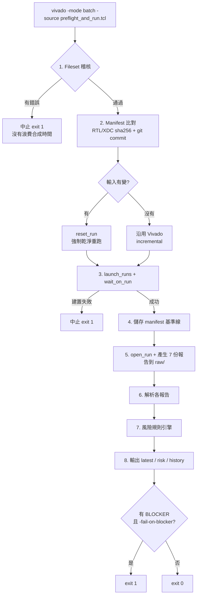

# vivado-report-analyze-flow

在離線工作站上，把每一次 Vivado 執行的報告壓縮成一份「AI agent 讀得完」的摘要，
在合成開始**之前**就擋掉「用到過期 RTL / 沒加進 fileset 的 XDC」這類問題，
並對結果做**風險分級**，明確回答：**這個 bitstream 能不能拿去上板驗證？哪些問題必須先解掉？**

針對的環境：

| 項目 | 版本 |
|---|---|
| OS | Red Hat Enterprise Linux 6.9（離線，無法 pip 安裝套件） |
| Vivado | 2021.2，project mode（`.xpr` + `launch_runs`） |
| AI agent | OpenCode 1.17.3 + Qwen3.6-27B（本地執行） |

---

## 解決的三個問題

**1. Report 太大，塞爆 context window**

一份 routed 的 `report_timing_summary` 動輒上萬行。這個 flow 在本地先用 Python 解析，
只留下真正會影響判斷的內容：WNS/TNS/WHS/THS、`check_timing` 統計、clock 清單、
**最差的 10 條路徑**、以及跟上一次執行的比較。產出的 `latest_<run>.md` 大約 60~80 行。

需要看某條路徑的完整細節時，再用 `--show-path` 單獨撈出來 —— 預設精簡，需要才展開。

**2. 跑完才發現用的不是最新版本**

最常見的成因是：改了 `.xdc` 但忘記 `add_files` 加進 `constrs_1`。
這種情況 Vivado 自己的 out-of-date 偵測**不會**觸發 —— 因為那個檔案從頭到尾就不屬於這個
專案，無從偵測起。等到跑完一整輪 implementation 看到 timing 不對勁，時間已經浪費掉了。

`tcl/preflight_and_run.tcl` 在 `launch_runs` 之前先做稽核，發現問題直接中止：

- 磁碟上有 `.xdc` / RTL，但不在 fileset 裡 → **錯誤，中止**
- 專案引用的檔案在磁碟上已不存在 → **錯誤，中止**
- constraint 檔被 disable（`IS_ENABLED` = 0）→ **錯誤，中止**
- constraint 檔沒有用於 synthesis 或 implementation → 警告
- synth run 與 impl run 使用不同的 constraint fileset → 警告

同時對所有 RTL/XDC 做 sha256，跟上一次成功建置的紀錄比對。內容真的變了才 `reset_run`
強制乾淨重跑；沒變就沿用 Vivado 原本的 incremental 行為，不會每次都被迫全部重跑。

> 因為 XDC 沒有納入 git 版控，**檔案內容 hash 是唯一可靠的版本依據**，所以這裡不看 mtime
> （checkout / rsync 會動到 mtime 但內容沒變，不該觸發重跑）。RTL 的 git commit 只是額外
> 的佐證資訊。建議有空時把 `.xdc` 也納入 git，追蹤會更直接。

**3. 光看數字不知道「能不能上板」**

WNS = -0.234 ns 到底是「先上板沒關係」還是「絕對不能上板」？這需要 FPGA 的領域判斷，
而不只是把數字列出來。而且真正會在實機上咬人的問題（metastability、未指定 I/O standard、
壅塞）大多**不在 timing report 裡**。

所以除了 timing，flow 還會產生並解析 utilization、DRC、methodology、CDC、
clock interaction、control sets，然後對所有發現做風險分級。

---

## 完整分析流程

一次執行從頭到尾會經過八個階段。**前三個階段在合成開始之前**，這是刻意的 ——
輸入有問題時要在花掉一小時之前就攔下來。



### 各階段做什麼

| # | 階段 | 內容 | 負責的檔案 | 失敗時 |
|---|---|---|---|---|
| 1 | Fileset 稽核 | 掃描 `-rtl-dir` / `-xdc-dir`，與 `sources_1` / `constrs_1` 做差集；檢查專案引用但已不存在的檔案、被 disable 的 constraint、`USED_IN_*` 範圍、synth 與 impl 的 constraint fileset 是否一致 | `tcl/preflight_and_run.tcl` | **中止，不建置** |
| 2 | Manifest 比對 | 對所有 RTL/XDC 算 sha256（fileset ∪ 磁碟掃描），與上次**成功建置**的基準線比對；記錄 git commit 與未 commit 的設計檔 | `python/manifest.py` | 警告後繼續（不做變更偵測） |
| 3 | 建置 | 輸入有變或 Vivado 標記 `NEEDS_REFRESH` 才 `reset_run`；必要時先跑 synth 母 run | `tcl/preflight_and_run.tcl` | **中止**，指向 run log |
| 4 | 更新基準線 | 建置成功後才把這次的 manifest 存為新基準線 | `python/manifest.py --save` | — |
| 5 | 產生報告 | `open_run` 後產生 7 份報告到 `raw/`；每份各自 `catch`，並先刪除舊檔避免誤用上次的結果 | `tcl/timing_report_hooks.tcl` | 該份跳過，其餘照跑 |
| 6 | 解析 | timing 用專屬 parser；其餘六份共用通用表格解析（pipe 邊框 / ruler 對齊 / violation 區塊） | `vivado_report_parser.py`、`report_tables.py`、`vivado_reports.py` | 該項標為「未檢查」，**不會顯示成沒問題** |
| 7 | 風險評估 | 套用規則集，每項發現標上「阻擋 bring-up」「阻擋 sign-off」，嚴重度由這兩者推導 | `python/risk_rules.py` | — |
| 8 | 輸出 | 產生摘要、風險報告、歷史紀錄，並印出 `##RISK_BLOCKERS## <n>` 供 Tcl 讀取 | `analyze_run.py`、`risk_report.py`、`trend.py` | — |

### 資料怎麼流

```
專案 .xpr ──┐
            ├─► 階段 1 稽核 ──► preflight_<run>.json ──┐
磁碟 RTL/XDC ┘                                          │
            └─► 階段 2 hash ──► compare_<run>.json ─────┤
                                                        │
Vivado 建置 ──► raw/*.rpt (7 份) ──► 階段 6 解析 ────────┤
                                                        ▼
                                              階段 7 風險規則引擎
                                                        │
                    ┌───────────────────────────────────┼──────────────────┐
                    ▼                                   ▼                  ▼
          latest_<run>.md                       risk_<run>.md      history.jsonl
      (判定 + BLOCKER + timing，                (全部嚴重度，       (每次一行，
       AI agent 平常只讀這份)                    要細節才讀)         趨勢用)
```

三份輸出的分工就是這個專案的核心設計：**預設精簡，需要才展開**。
`latest_<run>.md` 約 100 行以內，原始報告的上萬行留在 `raw/` 不進 context window，
單一路徑的完整細節用 `--show-path` 按需取用。

### 兩個貫穿全流程的原則

**a) 能在建置前發現的，絕不等到建置後**

階段 1 抓的是「改了 `.xdc` 但沒 `add_files`」這類問題。這種情況 Vivado 自己的
out-of-date 偵測**永遠不會觸發** —— 因為那個檔案從頭到尾就不屬於這個專案，無從偵測起。
只有在建置前主動比對磁碟與 fileset 才抓得到。

**b) 沒檢查到的，絕不呈現為沒問題**

階段 6 任何一份報告解析失敗，都會在階段 7 變成明確的「未檢查的項目」並阻擋 sign-off，
而不是靜靜地不產生任何發現。這是風險報告最容易致命的地方。

### 執行時間

階段 1–2 只有檔案 I/O 與 hash，大型專案也在數秒內完成 ——
相對於一輪 implementation 幾乎免費，所以預設一律執行。

階段 5 的七份報告中，`report_drc` 與 `report_methodology` 在大型設計上可能各需數分鐘。
若要縮短，用 `-reports` 只留下你在意的（例如 `-reports "cdc drc"`）；
但被拿掉的項目會如實顯示為「未檢查」，不會假裝乾淨。

---

## 風險分級模型

每一項問題都用兩個獨立的判定來描述，因為在 FPGA 上這兩件事的答案常常不一樣：

- **是否阻擋上板 bring-up** —— 現在拿這個 bitstream 去實驗室，得到的結論可不可信？
- **是否阻擋 sign-off** —— 這樣可不可以交付？

嚴重度是從這兩個判定推導出來的，不是另外標記的，所以分級永遠自洽：

| 阻擋 bring-up | 阻擋 sign-off | 嚴重度 |
|---|---|---|
| ✓ | ✓ | **BLOCKER** |
| ✗ | ✓ | **CRITICAL** |
| ✗ | ✗（但需注意） | **WARNING** |
| ✗ | ✗ | **INFO** |

這個模型能表達 FPGA 領域最重要的一個區別：

- **Setup 違規可以降頻先上板** —— 降低時脈就能做其他項目的 bring-up，
  但原頻率下的行為未經驗證 → **CRITICAL**
- **Hold 違規與頻率無關** —— 降頻完全無效，實機會隨溫度／電壓／批次隨機出錯
  → **BLOCKER**

### 哪些會被判為 BLOCKER

| 來源 | 項目 | 為什麼不能上板 |
|---|---|---|
| timing | Hold 違規 | 與頻率無關，降頻無法迴避 |
| timing | Pulse width 違規 | 時脈脈寬低於 primitive 規格，行為未定義 |
| timing | `no_clock` | 那些 register 根本沒被 time 到，WNS 沒涵蓋它們 |
| timing | 組合迴路 | 靜態時序分析無法描述，行為不可預測 |
| timing | Setup 缺口 > 週期 10% | 要降的幅度大到已不具代表性 |
| timing | 未約束 endpoint > 總數 1% | WNS 無法代表這個設計 |
| CDC | Critical（CDC-1 等） | metastability，「實驗室正常、上板偶發」的典型根因 |
| clock interaction | 無共同來源卻被同步分析 | 相位關係不確定，算出的 slack 不成立 |
| DRC | `NSTD-1` / `UCIO-1` | 預設會擋下 write_bitstream；I/O 無電氣標準，有傷板風險 |
| DRC | Error | 違反硬體基本規則 |
| methodology | `TIMING-6/7/9` | Xilinx 自己標記為「時序結果不可信」 |

閾值集中在 `python/risk_rules.py` 的 `DEFAULT_THRESHOLDS`，可依團隊標準調整。

> **一個重要的安全性設計**：某項分析沒跑成功或無法解析時，**絕對不會顯示為「沒有問題」**。
> 它會以「未檢查的項目」明確列出，並阻擋 sign-off。
> 風險報告最怕的就是「看起來很乾淨，其實根本沒檢查」。

---

## 安裝（離線）

整包只用 Python 標準函式庫，沒有任何外部相依，直接複製到工作站即可：

```bash
scp -r vivado-report-analyze-flow user@fpga-ws:/opt/
```

### 確認 Python 3

先確認以下**任一項**可用（不需要 pip 安裝任何東西）：

```bash
# 1) 系統的 python3（RHEL 6.9 內建通常只有 python 2.6，需另外確認）
which python3 && python3 --version     # 需要 >= 3.4

# 2) Vivado 2021.2 自帶的 Python 3 —— 離線機器上一定存在
ls $XILINX_VIVADO/tps/lnx64/python-3*/bin/python3
```

`find_python` 會自動依序尋找上述兩者，通常不需要手動指定。若要指定，加上
`-python <路徑>`。

確認方式（用你實際要用的直譯器跑一次測試）：

```bash
cd /opt/vivado-report-analyze-flow
PYTHON=$XILINX_VIVADO/tps/lnx64/python-3.8.3/bin/python3 sh tests/run_tests.sh
```

---

## 使用方式

把原本手動的 `launch_runs` 換成這個單一入口：

```bash
vivado -mode batch -source /opt/vivado-report-analyze-flow/tcl/preflight_and_run.tcl -tclargs \
    -project   build/top.xpr \
    -run       impl_1 \
    -rtl-dir   rtl \
    -xdc-dir   constrs \
    -repo-root .
```

流程：稽核 fileset → 比對輸入 hash →（有變才）`reset_run` → `launch_runs` → `wait_on_run`
→ `open_run` → 產生七份報告 → 風險分級 → 輸出精簡摘要。

pre-flight 稽核失敗或 Vivado 建置失敗都會以非 0 狀態結束。
**風險分級預設不影響 exit code**（build 成功就是 0）；要用它來擋下後續的
`write_bitstream` 或部署動作時，加上 `-fail-on-blocker`。

### 常用選項

| 選項 | 說明 |
|---|---|
| `-project <xpr>` | **必要**，Vivado 專案 |
| `-run <name>` | 要建置的 run，預設 `impl_1` |
| `-rtl-dir <dir>` | 要稽核的 RTL 目錄，可重複指定 |
| `-xdc-dir <dir>` | 要稽核的 XDC 目錄，可重複指定 |
| `-outdir <dir>` | 分析輸出目錄，預設 `<xpr 所在目錄>/timing_analysis` |
| `-repo-root <dir>` | RTL 的 git working tree，用來記錄 commit |
| `-exclude <glob>` | 略過符合的檔案，可重複，例如 `-exclude "*/tb/*"` |
| `-check-only` | 只做稽核，不啟動建置（很快，適合修改後先檢查） |
| `-no-reset` | 即使輸入有變也不 `reset_run` |
| `-warn-missing-rtl` | RTL 不在 fileset 時只警告不中止 |
| `-jobs <n>` | `launch_runs` 的平行數，預設 4 |
| `-reports <list>` | 要產生的輔助報告，預設六份全開。例如只要 timing 與 CDC：`-reports "cdc"` |
| `-fail-on-blocker` | 有 BLOCKER 時以非 0 結束，用來擋下後續流程 |

只想快速檢查有沒有漏加檔案，不要真的跑合成：

```bash
vivado -mode batch -source .../preflight_and_run.tcl -tclargs \
    -project build/top.xpr -rtl-dir rtl -xdc-dir constrs -check-only
```

### 產出的檔案

全部放在 `<outdir>`（預設 `timing_analysis/`）：

```
timing_analysis/
  latest_impl_1.md              <- AI agent 平常只需要讀這個檔案
  risk_impl_1.md                <- 完整風險報告（要細節時才讀）
  risk_impl_1.json              <- 風險評估的機器可讀版本
  latest_impl_1.json            <- 指向本次 run 完整紀錄的指標
  history.jsonl                 <- 每次執行一行，累積趨勢用，很小
  history/run_<時間>_impl_1.json <- 單次執行的完整結構化資料
  manifests/
    manifest_impl_1_current.json   <- 上一次成功建置的輸入 hash（基準線）
    manifest_impl_1_previous.json
    compare_impl_1.json
    preflight_impl_1.json          <- 稽核結果（錯誤與警告）
  raw/                          <- 原始報告，不要餵給 AI
    timing_summary_impl_1.rpt
    utilization_impl_1.rpt
    drc_impl_1.rpt
    methodology_impl_1.rpt
    cdc_impl_1.rpt
    clock_interaction_impl_1.rpt
    control_sets_impl_1.rpt
```

建議把 `timing_analysis/` 加進 FPGA 專案的 `.gitignore`。

### 深入單一路徑

摘要只列出 Top 10 路徑的重點欄位。要看某條路徑的完整 delay table：

```bash
python3 /opt/vivado-report-analyze-flow/python/analyze_run.py \
    --outdir timing_analysis --stage impl_1 \
    --show-path "accum_reg[7]"
```

會直接從原始報告中，只印出那一條路徑的完整區塊。

### 手動重新分析既有的報告

不需要重跑 Vivado，也可以對任何 `report_timing_summary` 產物重新分析：

```bash
python3 /opt/vivado-report-analyze-flow/python/analyze_run.py \
    --stage impl_1 \
    --timing-summary timing_analysis/raw/timing_summary_impl_1.rpt \
    --outdir timing_analysis
```

---

## 摘要裡有什麼

`latest_<run>.md` 的結構，依重要性排序：

0. **驗證風險判定** —— 兩種判定的結論（可否上板 / 可否 sign-off）、各嚴重度的數量、
   **BLOCKER 的完整清單**（每項都附「為什麼有風險」與「建議動作」）、
   以及未檢查的項目。CRITICAL 以下的詳細說明放在 `risk_<run>.md`，
   避免把 context window 塞爆。
1. **Input versions** —— 這次用的 RTL commit（以及是否有未 commit 的設計檔）、
   XDC 內容 digest、跟上次比是否改變、稽核結果。
   *看到 timing 異常時第一個要確認的就是這段。*
2. **Design timing summary** —— WNS/TNS/WHS/THS 與違規 endpoint 數，
   每一項都附上跟上次執行的差異與方向（better / worse）。
3. **Constraint sanity (check_timing)** —— `unconstrained_internal_endpoints`、
   `no_clock`、`no_input_delay` 等統計。這是判斷「constraint 是不是根本沒生效」
   最快的指標：數字暴增通常代表某個 XDC 沒被套用，這時 slack 數字本身沒有參考價值。
4. **Clocks** —— 各 clock 的 period / frequency。
5. **Top 10 worst setup paths** —— slack、path group、起訖點、logic levels、
   logic/route 延遲佔比（route 佔比過高通常是 placement/congestion 問題，
   logic levels 過多則是要考慮 pipeline）。
6. **Violating endpoints vs previous run** —— 新增與已解決的違規 endpoint。
   判斷「這次修改到底有沒有效」最直接的一段。
7. **Trend** —— 最近 8 次執行的 WNS/TNS/失敗數/BLOCKER 數，
   以及各自對應的 RTL commit。

---

## 與 OpenCode / Qwen 整合

見 [`docs/opencode-integration.md`](docs/opencode-integration.md)，
內含可直接複製進專案 `AGENTS.md` 的段落。

核心原則：**agent 只讀 `latest_<run>.md`，永遠不要讀 `raw/` 底下的原始 `.rpt`。**

---

## 檔案結構

```
tcl/
  preflight_and_run.tcl      單一入口：稽核 → 建置 → 報告 → 風險（階段 1-4）
  timing_report_hooks.tcl    產生 7 份報告並呼叫 Python（階段 5）
                             也可獨立 source 給 non-project batch 流程使用
python/
  manifest.py                RTL/XDC hash manifest 與變更偵測（階段 2、4）
  vivado_report_parser.py    timing summary 專屬 parser
  report_tables.py           通用表格解析（pipe 邊框 / ruler 對齊 / violation 區塊）
  vivado_reports.py          其餘六份報告的 parser，全部 fail-soft（階段 6）
  risk_rules.py              風險規則集與嚴重度推導（階段 7）★ 閾值在這裡調
  risk_report.py             中文風險報告的渲染
  trend.py                   history.jsonl 的讀寫與跨執行比較
  analyze_run.py             CLI 入口，串起上述所有模組（階段 8）
  check_reports.py           自我檢查：對真實報告驗證各 parser 是否正確
examples/
  sample_*.rpt               七種報告的手刻範例，供測試與格式對照
tests/
  vivado_stub.tcl            假的 Vivado 專案物件模型，讓稽核邏輯能在 tclsh 下測
  test_preflight.tcl         pre-flight 情境測試
  test_*.py                  parser / manifest / 風險規則的單元測試
  run_tests.sh               一次跑完全部
docs/
  opencode-integration.md    給 Qwen 的 AGENTS.md 段落與判讀指引
```

要調整判定標準時，唯一需要改的是 `python/risk_rules.py` 裡的 `DEFAULT_THRESHOLDS`
與各規則的兩個旗標；其餘模組不需要動。

---

## 測試

```bash
sh tests/run_tests.sh
```

不需要 Vivado，也不需要 licence：

- **Python 單元測試** —— timing parser（含 `NA` 值、空報告、跨 clock group 排序）、
  六種報告的 parser（含截斷與格式不符必須降級而非拋例外）、
  manifest（hash 比對、mtime 不算變更、git porcelain 解析）、趨勢計算、CLI 行為。
- **風險規則測試** —— 每條規則各一組輸入，斷言嚴重度與兩個判定旗標都正確。
  重點案例：hold 違規兩者皆阻擋；setup 違規不阻擋 bring-up；
  setup 缺口超過週期 10% 升級為 BLOCKER；`Safely Timed` 不得誤判為 unsafe；
  **CDC 報告解析失敗時必須產生「未檢查」項目且不得判定為安全**。
- **Pre-flight 情境測試** —— `tests/vivado_stub.tcl` 模擬一個最小的 Vivado 專案物件模型
  （fileset、檔案屬性、run 生命週期、各 `report_*` 指令），用 `tclsh` 直接驗證：
  漏加 XDC / 漏加 RTL / constraint 被 disable 都必須在 `launch_runs` **之前**中止；
  輸入沒變時不能做多餘的 `reset_run`；
  有 BLOCKER 時預設仍回傳 0，加 `-fail-on-blocker` 才非 0；
  某份報告產生失敗時必須顯示為「未檢查」。

---

## 用真實報告驗證

所有 parser 都是依 Vivado 2021.2 的標準報告格式撰寫的，`examples/` 下是照該格式手刻的範例。
真實專案的格式可能有出入，所以第一次使用後請跑一次自我檢查。

### 自我檢查工具

```bash
python3 python/check_reports.py --dir timing_analysis/raw --stage impl_1
```

它會對每一份報告跑對應的 parser，然後印出**實際抽取到的數值**，讓你直接對照原始 `.rpt`
自行確認正確與否 —— **不需要把任何檔案傳出去**。

```
========================================================================
utilization
========================================================================
  OK        timing_analysis/raw/utilization_impl_1.rpt
    lut        Slice LUTs             185458/203800 = 91.00%
    register   Slice Registers        132470/407600 = 32.50%
...
========================================================================
risk assessment
========================================================================
  bring-up: BLOCKED   sign-off: BLOCKED
    [BLOCKER ] CDC.CRITICAL   CDC-1：1-bit unknown CDC circuitry（2 處）
```

離開狀態：全部解析成功回傳 0，有任何一份失敗回傳 1。

### 解析失敗時

工具會針對失敗的報告印出**結構指紋** —— 只保留欄位標題、表格框線、章節標號、
severity 關鍵字這類**版面結構**，並把階層式的 instance/net 名稱遮成 `<name>`：

```
  --- structural fingerprint (instance names masked) ---
  | Tool Version : Vivado v.2021.2 (lin64) Build 3367213
  | Design State : Routed
  +----------+--------+---------------------------+------------------+
  | Severity | CDC ID | Description               | Endpoint         |
  +----------+--------+---------------------------+------------------+
  | Critical | CDC-1  | 1-bit unknown CDC         | <name>           |
```

把這段貼出來就足以修正 parser（以上例來說，欄位是 `CDC ID` 而不是預期的 `ID`）。
設計名稱不會被輸出，但**送出前請自己先看過** —— 遮罩是刻意保守的作法，不是保證。

### 逐項確認清單

1. 七份報告都有產生在 `timing_analysis/raw/`。
2. `check_reports.py` 全部回報 OK。
3. 抽取到的數值與原始 `.rpt` 一致（特別是 WNS/TNS、資源使用率、各 rule 的 severity）。
4. `latest_<run>.md` 中沒有非預期的「未檢查的項目」。
5. 風險判定與你對該設計的實際認知相符。若某條規則太嚴格或太寬鬆，
   調整 `python/risk_rules.py` 的 `DEFAULT_THRESHOLDS` 即可。

**DRC、methodology、CDC、clock interaction 這四份最需要實機確認**，
因為它們的文字格式版本差異最大。每個 parser 都是獨立且 fail-soft 的，
單一格式不符只會讓該項顯示為「未能解析」，不會影響其他分析，也不會中斷 flow。
